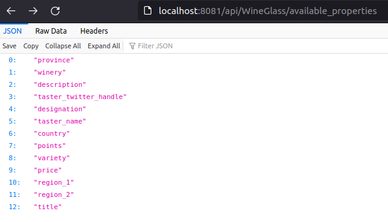
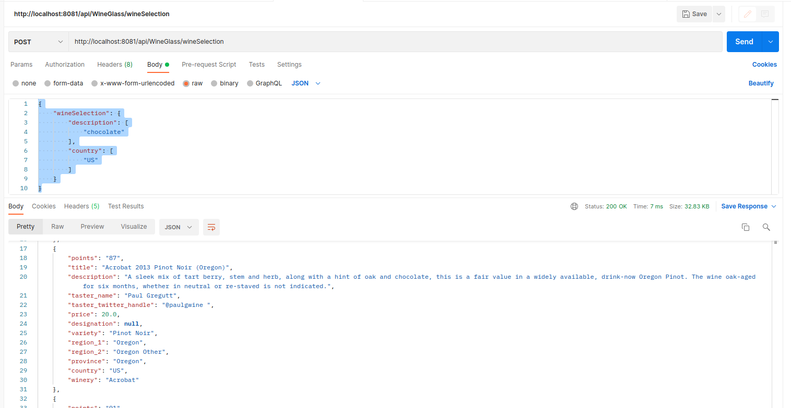
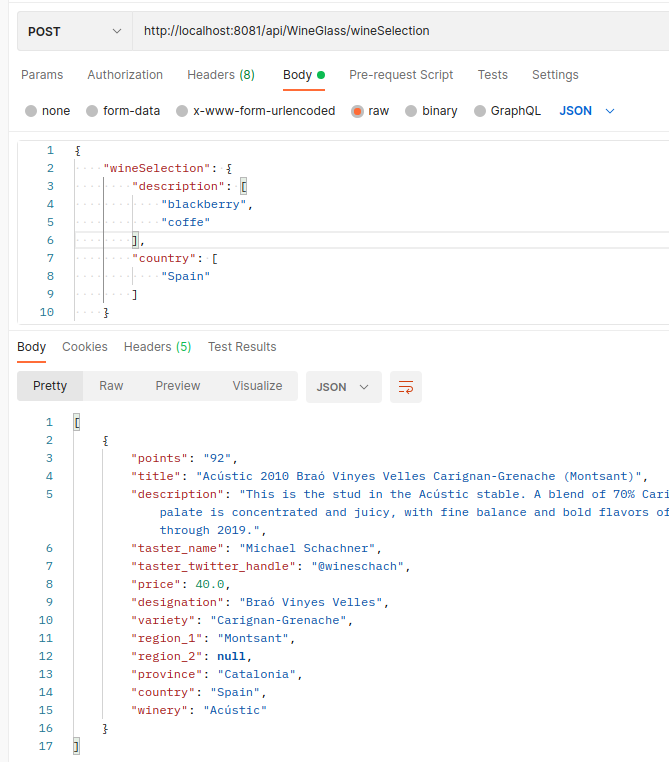
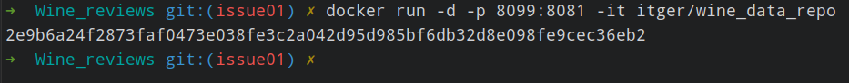
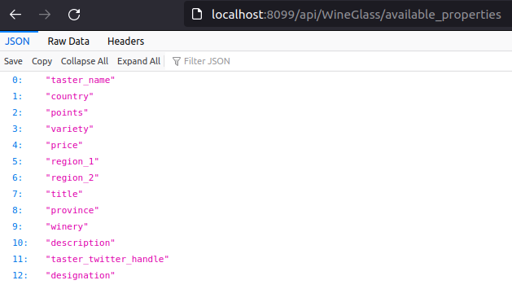

# Wine_reviews
## Wine reviews with variety, location, winery, price, and description.

All the dataset resides in-memory.

The dataset was taken from [www.kaggle.com](https://www.kaggle.com/zynicide/wine-reviews#winemag-data-130k-v2.json)
To use this sample project you must download the winemag-data-130k-v2.json. 
In application.properties, under 'wine.data.file' property, you should insert the winemag-data-130k-v2.json location.
Currently, only a small subset of the dataset is available on the resources folder.

http://localhost:8081/swagger-ui.html endpoint is also available.

Running on docker is easy:

`mvn clean install`

`mvn spring-boot:build-image`

finally:

`docker run -d -p 8099:8081 -it itger/wine_data_repo`

